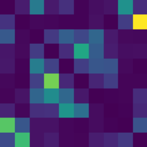

# Adversarial Label Flips

Given a neural network classifier and an untargeted evasion attack, in
what class does the adversarial example fall post-attack? In the following,
we will answer this question by evaluating some state of the art attacks
on simple neural network classifiers trained on industry standard datasets.
We discover that semantically similar classes are more likely to be confused
with another, leading us to hypothesise that the convolutional neural
networks recognise these similarities.

We will breifly outline our results below. For a thorough description of our methods plsease refer to our [paper](./paper/AdversarialLabelFlips.png).

## Results

We present the confusion matrices for the **Carlini-Wagner Attack:**. The (similar) results of the projected gradient decent attacks can be found in our [paper](./paper/AdversarialLabelFlips.png).

### CIFAR-10

### FashionMNIST

### MNIST

### Symmetry

One of the standout features of our results is the high degree of symmetry in the CIFAR-10 confusion matrices. This implies that if an adversarial example of class i is mistaken for class j, the reverse is also likely. A discernible pattern across all datasets reveals that the pairs "Automobile"-"Truck", and "Dog"-"Cat" are most commonly confused, which aligns with human perspective. Misclassifications between animals and vehicles are significantly less common.

However, this hypothesis seems less applicable for the MNIST and FashionMNIST datasets.

### Catch-all Classes

Adversarial examples created with large perturbation budgets (`𝜖`) are most often misclassified as "frog", and "8" for MNIST and CIFAR-10 respectively. For FashionMNIST, there are multiple high probability classes. To better understand this phenomenon, we generated and classified 10,000 white noise images sampled from a uniform distribution on the input domain.

The results indicate that the tested neural networks tend to default to one or multiple outputs for low probability images. This behaviour significantly impacts adversarial examples computed with large perturbation budgets.

## Background and Related Work

Since their discovery by [Szegedy et al.](https://arxiv.org/abs/1312.6199), adversarial examples have been extensively studied. We focus on the following established attacks:

- Fast Gradient Sign Method (FGSM) by [Goodfellow et al.](https://arxiv.org/abs/1412.6572)
- Projected Gradient Descent (PGD) as introduced by [Madry et al.](https://arxiv.org/abs/1706.06083)
- Carlini-Wagner Attack by [Carlini and Wagner](https://arxiv.org/abs/1608.04644)
- Brendel-Bethge Attack by [Brendel and Bethge](https://arxiv.org/abs/1910.09338)

## Conclusion

In conclusion, our studies have uncovered two intriguing patterns:

- Adversarial images with small perturbation sizes often lead to surprisingly symmetric confusion matrices, suggesting the classifier's understanding of the relationship between certain classes.
- Attacks that employ a larger `𝜖` typically cluster into one or multiple specific classes. This can be attributed to the CNN's tendency to use these classes as a catch-all for images it struggles to classify correctly.

We hope our research offers valuable insights into adversarial attacks and inspires further investigations into this fascinating area. For more details please read our [paper](./paper/AdversarialLabelFlips.png).
